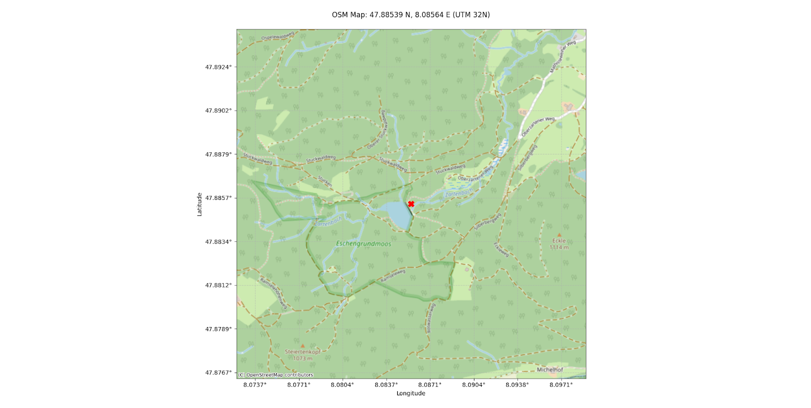
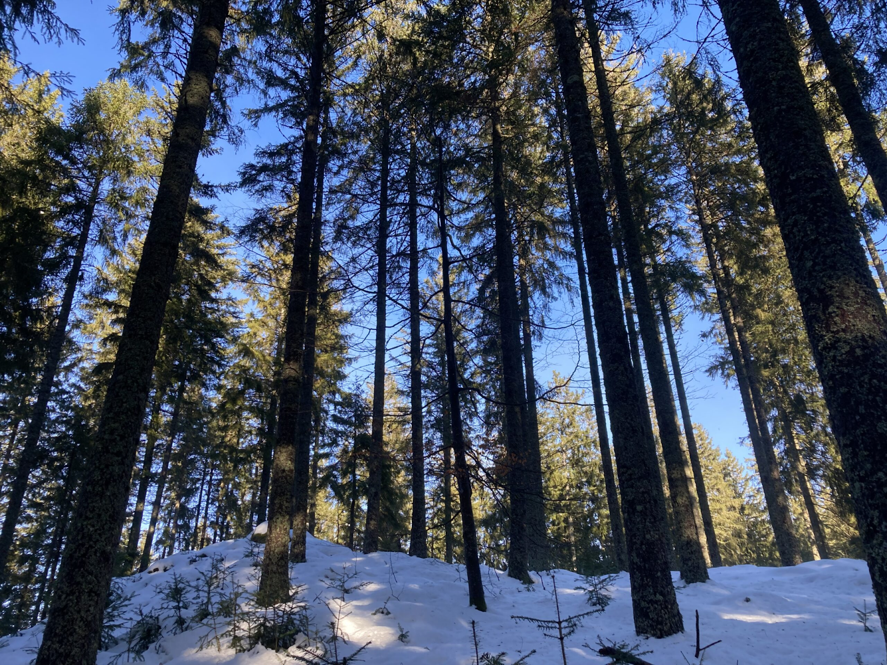
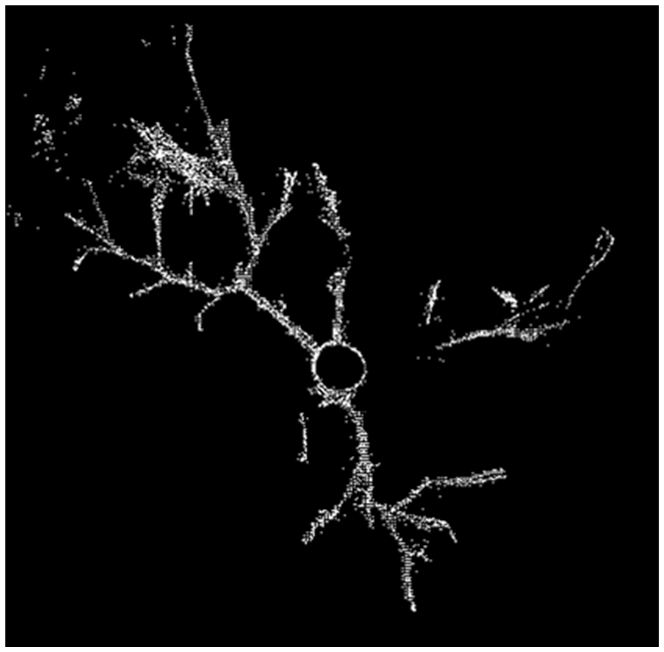
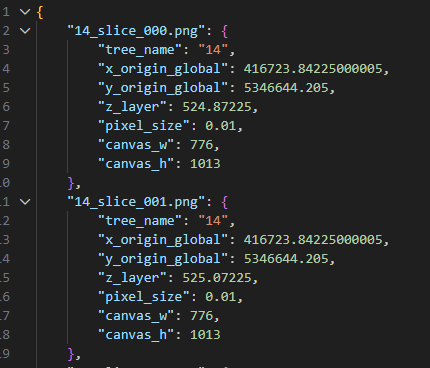

# 2.1 Data Acquisition and Preparation

This chapter describes the complete workflow used to transform raw TLS data into a labeled image dataset suitable for training a YOLO-based object-detection model. The process consists of four main stages: data acquisition, tree segmentation, conversion into two-dimensional raster images, and annotation of the same for model training.

---

## 2.1.1 Field Data Acquisition

The data used was collected during an excursion as part of the module **“Modern methods of forest and environmental surveying using terrestrial laser scanning and UAVs”**, led by **Julian Frey**.

The excursion was on **2 March 2026** in the **Mathislewald**, located in the Black Forest near Freiburg, Germany. The approximate coordinates of the study site are:

- **WGS84 (DMS):** 47°53'07.4"N, 8°05'08.3"E  
- **WGS84 (Decimal):** 47.88539° N, 8.08564° E  
- **Projected CRS:** UTM Zone 32N (EPSG:32632)

<figure>
  

    
    <figcaption><b>Figure 1:</b> An OSM Map of the Area of Interest</figcaption>
  

</figure>

During the excursion, students were trained in the operation of both **terrestrial laser scanning (TLS)** systems and **UAV-based surveying platforms**. The TLS data collected during this exercise were subsequently made available to participants for use in individual analysis projects.

The point clouds used in this work were captured using a **RIEGL VZ-400i terrestrial laser scanner**, a high-resolution TLS instrument capable of producing dense three-dimensional representations of forest stands  ([RIEGL Laser Measurement Systems GmbH, 2025](./references.md#riegl2025)).

The scanned stand consists of a **mixed coniferous forest**, predominantly composed of *Picea abies* (Norway spruce), along with smaller understory vegetation.

<figure>
  

    
    <figcaption><b>Image 1:</b> An Image of the University research plot within the Matthislewald in the winter</figcaption>
  

</figure>

---

## 2.1.2 Tree Segmentation from the Stand Point Cloud

The TLS scans merged together initially represent the entire forest stand as a single large point cloud. However, the individual trees needed to be separated for annotation.

To obtain these, the automated tree segmentation methods designed for terrestrial laser scanning data on **3dtrees.earth** were used. This reduced the time required for manual tree segmentation.

The output of this step was a **large segmented point cloud file** in which each point was assigned a **TreeID**, identifying the tree to which the point belongs.

---

## 2.1.3 Splitting the Segmented Dataset into Individual Tree Files

The segmented dataset contained all trees within a single `.laz` file. Due to the large size of this dataset, loading the entire file into **CloudCompare**  frequently resulted in freezing or crashing of the software on our computers.

To make the dataset manageable, the file was divided into separate point clouds containing **one tree per file**. This was done using a custom R script called **`Segmentor.R`**, which has been made available in the project repository.

Here, the segmented dataset is imported into the **lidR** environment and re-tiled into smaller spatial chunks. This allowed the data to be processed sequentially without loading the entire dataset into memory. Within each tile, points were grouped according to their tree identifier from the segmentation attribute and written as temporary partial tree files, which were then merged and exported as a single `.las` file.

After running the script, each tree existed as a separate .las file, which could be loaded independently.

---

## 2.1.4 Manual Inspection and Selection of Trees

Once the individual tree files were created, they were loaded into **CloudCompare** for visual inspection, where each group member selected **two to three trees** that required the minimal manual correction.

Minor adjustments were then made to remove misclassified points and ensure that each dataset represented a **single clean tree point cloud**.

---

## 2.1.5 Converting 3D Trees into 2D Image Slices

Object detection models such as YOLO operate on **two-dimensional images**, while TLS data consists of **three-dimensional point clouds**. Therefore, we converted each tree into a stack of two-dimensional slices using a Python script called **`slicer.py`**, also available in the project repository.

Using the `laspy` library, each tree point cloud is loaded and its spatial bounds are calculated to define a consistent image canvas. The tree is then vertically stratified into `**20 cm**` horizontal layers.

For each slice, points are projected onto the **XY plane** to create a **2D density raster** at a **1 cm × 1 cm pixel resolution**. To ensure visual clarity, pixel intensities are normalized by clipping the **99th percentile** and rescaling the values to a standard 8-bit range before exporting each cross-section as a PNG image.

In addition to the images, the script also generates a **metadata file (`metadata.json`)** containing:

- slice height  
- global spatial origin  
- pixel resolution  
- canvas dimensions

This metadata enables the original 3D spatial context to be reconstructed if required.

  <table>
    <tr>
      <td></td>
      <td></td>
    </tr>
  </table>
  
<b>Image 2:</b> A Cross-Section Image of a Conifer Point Cloud (left) and example metadata of the slice (right)

On average, this process generated approximately **150 slices per tree**, depending on tree height.

---

## 2.1.6 Dataset Annotation

The resulting slice images were imported into **CVAT (Computer Vision Annotation Tool)** for manual labeling. Each image was inspected and annotated using **bounding boxes**.

Four object classes were defined:

| Class | Description |
|------|-------------|
| **Trunk** | Cross-sections belonging to the main stem |
| **Branch** | Larger lateral branches extending from the trunk |
| **Twigs** | Fine distal branches and terminal growth |
| **Grass** | Low vegetation and forest floor clutter |

The dataset was subsequently exported into the **YOLO 1.1 format**, which includes **TXT** files describing the annotation boxes (see Image below).

