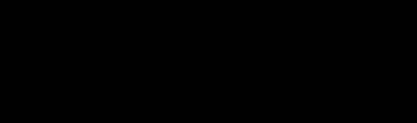

# 2.2 Preprocessing and Multi-Channel Slicing Pipeline

Instead of using a standard RGB image representation, the dataset was transformed into a **four-channel image format**. These channels capture not only the current slice but also contextual information from neighboring slices and the vertical position within the tree. The entire preprocessing pipeline was implemented using Python scripts available in the project repository.

---

## 2.2.1 Concept of Multi-Channel Slice Representation

A single horizontal slice of a tree provides only a limited view of the structure. For example, a circular cluster of points in one slice could represent the trunk, a large branch, or dense twig growth. Without additional context, these structures may appear visually similar.
To improve interpretability for the model, each slice was therefore expanded into a four-channel feature map containing information from neighboring slices and the overall height of the tree. The key methodological contribution of this project is the introduction of a multi-channel slice representation that incorporates vertical context from neighboring layers of the tree, which helps the neural network recognize continuous structures such as trunks and branches.

<figure>
  <div align="center">
    
    <figcaption><b>Figure 2:</b> Animation Visualizing How the Three Images Come Together to Form One Image With Three RGB Channels</figcaption>
  </div>
</figure>

---

## 2.2.2 Creating the Channel Structure

The multi-channel dataset was generated using the Python script **`organize.py`**included in the repository. Four input channels were constructed to provide both local vertical context and relative height information.

Channel 0 contains the **original slice images** generated by **`slicer.py`** representing the point density distribution for each vertical layer of a tree.

The images are stored in the directory:

```
channel0/
```

Each file follows the naming structure:

```
TreeName_slice_###.png
```

where the numeric suffix represents the slice index.

---

Channels 1 and 2 provide vertical context by including the two preceding slices. Channel 1 corresponds to the slice directly below the current slice (*slice i − 1*), while Channel 2 corresponds to the slice two layers below (*slice i − 2*). These channels were generated by shifting the slice indices accordingly and storing the resulting images in the directories `channel1/` and `channel2/`.

Channel 3 encodes the relative height of each slice within the tree. For each tree, the total number of slices was determined and uniform grayscale images were generated with intensity values ranging from 0 (lowest slice) to 255 (highest slice), representing the normalized vertical position. This information allows the model to distinguish structures that may appear similar locally but typically occur at different heights within the tree.

---

## 2.2.3 Combining Channels into Multi-Channel Images

Once the four channel folders were created, the images were merged into a single multi-channel dataset using the Python script **`combine_channels.py`**.

This script reads the grayscale images from:

```
channel0/
channel1/
channel2/
channel3/
```

and stacks them into a four-dimensional array using the following order:

```
[R, G, B, A]
```

where:

- **R** = primary slice  
- **G** = previous slice  
- **B** = antecedent slice  
- **A** = height index

> [!NOTE]
> Although the channels are mapped to the conventional RGBA order, they do **not represent color information**. Instead, each channel contains a different structural feature derived from the point cloud.

The final dataset is stored in the folder:

```
multichannel_tifs/
```

Each file retains the original slice name so that it can be traced back to the corresponding tree and vertical layer.