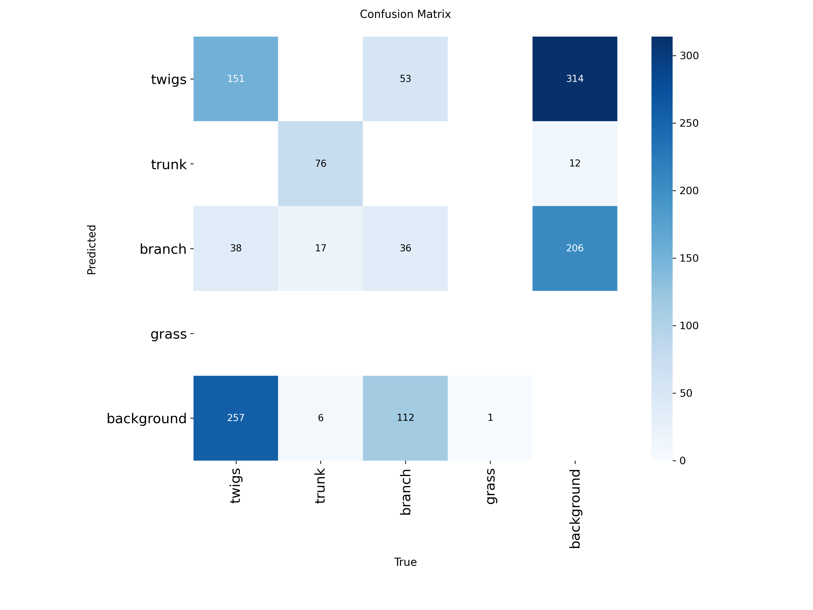
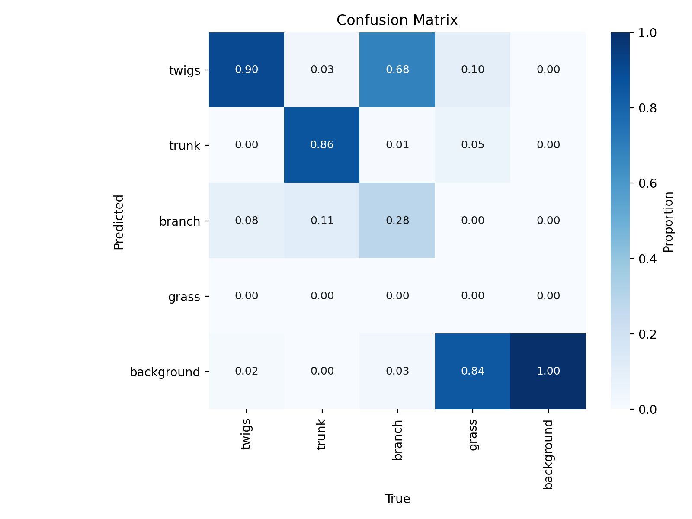
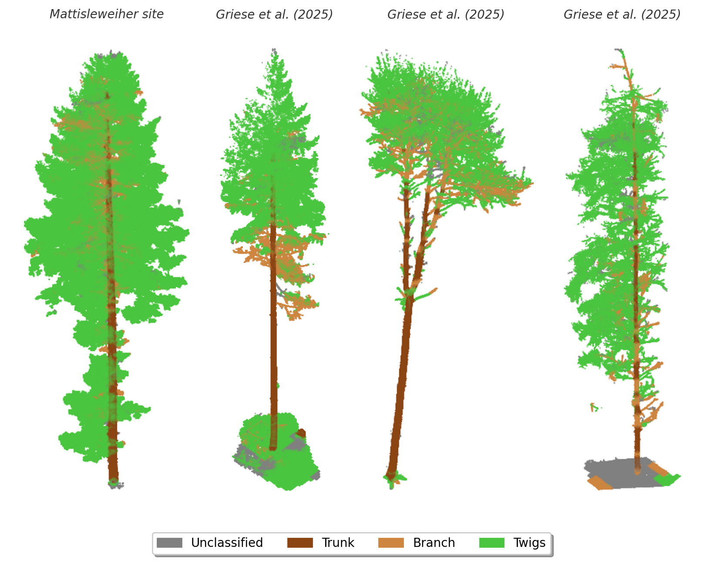

# 3.1  Results

## 3.1.1 Evaluation with test data

  <table>
    <tr>
      <td></td>
      <td></td>
    </tr>
  </table>
  
<b>Figure 3:</b>  Normalized confusion matrices. Left: bounding box based, right: pixel based evaluation of assigned class.

Model performance is substantially better when class assignments are evaluated at the pixel level. As this better reflects the intended application, the following discussion focuses on the pixel-based results. Different confidence thresholds for bounding-box selection were tested, and a threshold of 10% provided good overall performance. The trunk class is identified very reliably, with 86% of trunk cases classified correctly and only occasional confusion with branches. Twigs are also detected robustly; however, distinguishing branches from twigs remains challenging, as 68% of branches are misclassified as twigs. Grass was only sparsely represented in the training and test data and was therefore poorly classified. 

| Metric | Bounding Box | Pixel-based | Pixel-based (without tree from Matthisleweiher) |
| :--- | :---: | :---: | :---: |
| Precision | 0.34 | 0.81 | 0.71 |
| Recall | 0.34 | 0.74 | 0.61 |
| F1 Score | 0.34 | 0.77 | 0.66 |
| mAP50 | 0.31 | - | - |
| mAP50-95 | 0.17 | - | - |

## 3.1.2 Visualization

<figure>
  

    
    <figcaption><b>Figure 4:</b> Visualization of reconstructions of the four individual trees from the test dataset. Points are classified into unclassified, trunk, branch, and twig components</figcaption>
  

</figure>

The visualizations of the trees used for testing in Figure 4 support the results presented above. Trunks are segmented reliably, whereas the distinction between branches and twigs remains less consistent in visually complex parts of the tree. It becomes apparent that the model performs worse for the tree on the right, which was also observed in the metrics (precision = 0.45, recall = 0.29, F1 = 0.3531). In contrast, the deciduous tree does not exhibit notably weaker performance (precision = 0.85, recall = 0.84,  F1 = 0.84) than the coniferous trees, despite being underrepresented in the training data.
